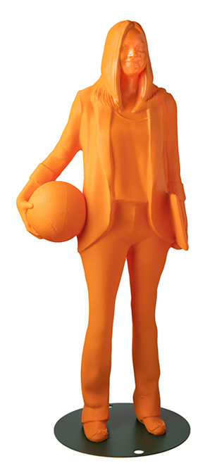
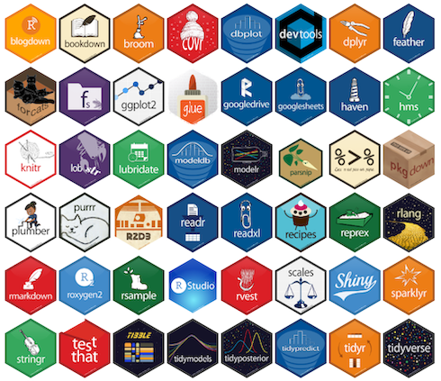
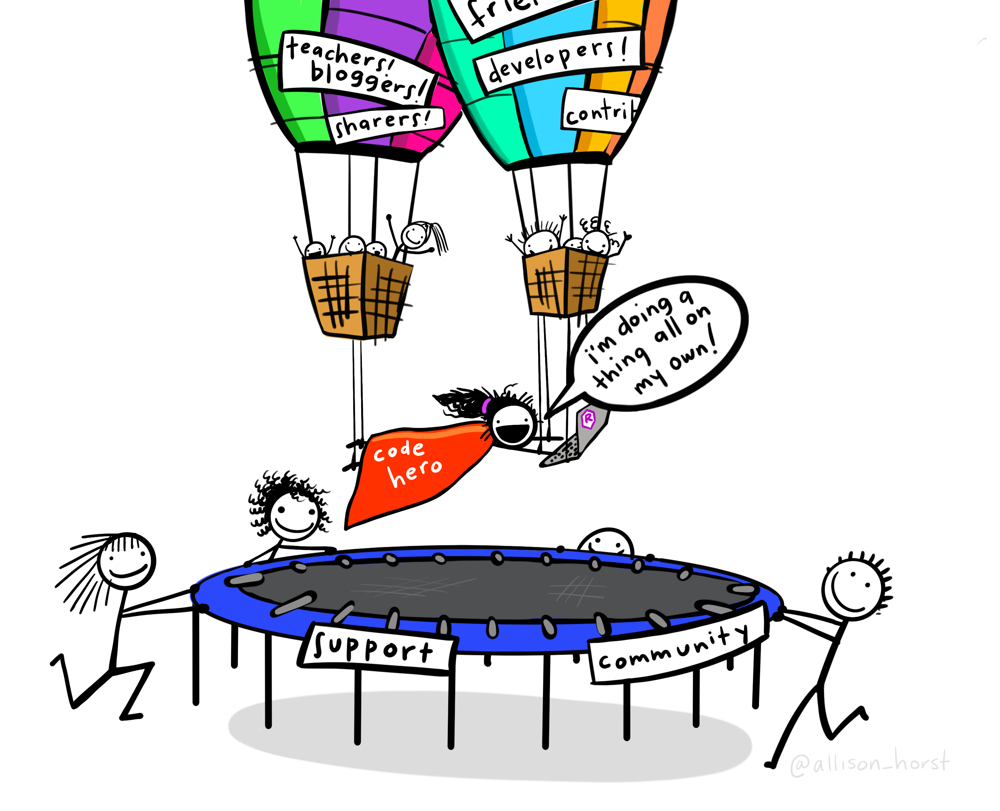
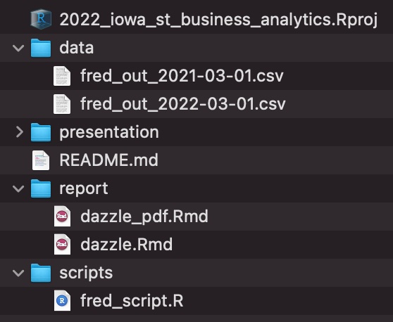
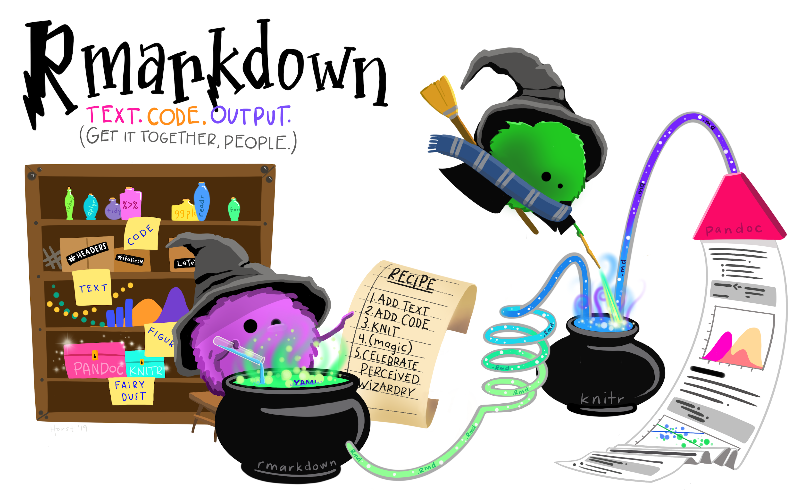
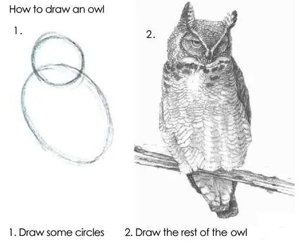
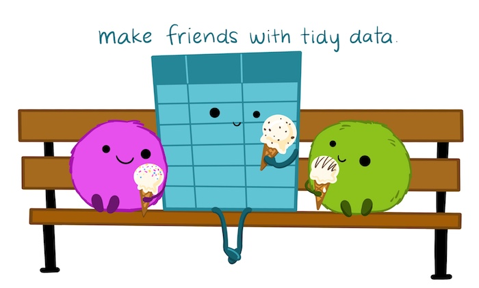
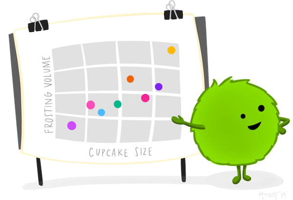

---

output:
  xaringan::moon_reader:
    seal: false
    self_contained: true
    css: custom.css
    nature:
      slideNumberFormat: "%current%"
      highlightStyle: github
      highlightLines: true
      ratio: 16:9
      countIncrementalSlides: false
---

class: inverse center middle

# Reproducible Analytical Workflows in R

## Lindsey Dietz, PhD
### 2022 Iowa State Business Analytics Symposium
### April 5, 2022

### Download talk materials: github.com/iamaspacecoyote/2022_iowa_st_business_analytics

---

```{r setup, include=FALSE}
options(htmltools.dir.version = FALSE)
knitr::opts_chunk$set(
  fig.width=9, fig.height=3.5, fig.retina=3,
  out.width = "100%",
  cache = FALSE,
  echo = TRUE,
  message = FALSE, 
  warning = FALSE,
  hiline = TRUE
)
```

```{r xaringan-themer, include=FALSE, warning=FALSE}
library(xaringanthemer)
style_mono_accent(
  base_color = "#1c5253",
  header_font_google = google_font("Josefin Sans"),
  text_font_google   = google_font("Montserrat", "300", "300i"),
  code_font_google   = google_font("Fira Mono")
)
```

## Disclaimer

The views expressed in this presentation are strictly my own. They do not necessarily represent the position of the Federal Reserve Bank of Minneapolis or the Federal Reserve System.

---

## Who am I?

.left-column[
+ [Financial Economist/Stress Testing Production Function Lead @ Federal Reserve Bank of Minneapolis](https://www.minneapolisfed.org/news-releases/2021/dietz-recognized-for-excellence-in-bank-supervision)
    - I lead the team working on implementation, execution, and analysis of models for stress testing the nation's largest banks.

+ R Enthusiast and STEM diversity advocate
    - [Co-creator of the noRth R user conference](https://rnorthconference.github.io/)
    - [Co-organizer of the R Ladies - Twin Cities meetup](https://www.meetup.com/rladies-tc/members/)
    - [IF/THEN AAAS STEM Ambassador](https://www.si.edu/womensfutures)

+ Stathlete
    - [BS and MS in Math; Hall of Fame collegiate athlete at the University of Minnesota-Duluth](https://www.youtube.com/watch?reload=9&v=AzCXX9gH7ME)
    - PhD in Statistics from University of Minnesota-Twin Cities


]

.right-column[
```{r echo=FALSE, out.width= "85%"}

```
]
---
class: inverse center middle

# Let's Dive In!

# https://github.com/iamaspacecoyote/2022_iowa_st_business_analytics

---
## Objectives of this discussion

- **Provide a starter pack on the R ecosystem to support report creation in HTML**

--

- Provide examples of packages to build reports and display analysis

--

- Sprinkle in tips and tricks to make your reports dazzling and reproducible


---

## Self-study extensions (i.e. not covered)

- Setting up version control 
    - Please use it! Check out Jenny Bryan's [Happy Git and Github with R](https://happygitwithr.com/)

--

- Details of the tables or graphics packages 
    - These could easily be (and probably already are) their own long form tutorials.

---

## Can you relate to this process of reporting?

- Do analysis in one tool (Excel/R/Python/SAS/SPSS/Minitab/Stata/Matlab)

--

- Make tables and charts in another tool (Excel/Tableau/PowerBI)

--

- Screenshot or paste everything into a text editor (Word/LaTeX)

--

- Turn it into a final product (PDF/PowerPoint)
--
.center[

]

---

## We can do it all with R!

```{r echo=FALSE, out.width= "95%", out.extra='style="float:center"'}
knitr::include_graphics("img/environmental-data-science-r4ds-general.png")
```

---

## What is R?

 - R is an **open source software** suite including
    - an effective **data handling** and storage facility,
    - a suite of operators for **calculations** on arrays, in particular matrices,
    - an integrated collection of intermediate tools for **data analysis and graphics**, and
    - a **programming language** which includes conditionals, loops, user-defined recursive functions and input and output facilities.

--

## R works best when combined with RStudio

RStudio is an **open source** integrated development environment (IDE) for R. It includes a console, syntax-highlighting editor that supports direct code execution, as well as tools for plotting, history, debugging and workspace management.

---

## R <- Iowa State University
Two R visionaries did their PhDs in Statistics at Iowa State. 
.pull-left[
[**Hadley Wickham**](https://hadley.nz/), Chief Scientist at RStudio
Creator of the [`tidyverse`](https://www.tidyverse.org/) ([`ggplot2`](https://ggplot2.tidyverse.org/), [`dplyr`](https://dplyr.tidyverse.org/), ...)

]
.pull-right[
[**Yihui Xie**](https://yihui.org/), Software Engineer at RStudio
Creator of [`rmarkdown`](https://rmarkdown.rstudio.com/) + workflow tools

]

---

## [*Action Item*] Download and Install R & RStudio

- Install R 4.1.3 or higher
    - Navigate to a geographical close CRAN mirror: https://cran.r-project.org/mirrors.html
        - Use the Iowa State mirror: https://mirror.las.iastate.edu/CRAN/
    - Choose the download for your operating system

- Install RStudio 2022.02.0+443 or higher
    - Navigate to https://rstudio.com/products/rstudio/download/
    - Choose the download for your operating system
---

## R packages

 - The open source nature of R allows users to create software extensions called *packages*.
 - Packages are the fundamental units of reproducible R code and contain groups of useful functions.
     - [CRAN is a great place to find packages.](https://cran.r-project.org/web/packages/available_packages_by_name.html)
 - [You can make your own packages to support your work!](https://www.youtube.com/watch?v=J45Hs9XyN68)
 
 .center[
 
 ]

---

## [*Action Item*] Installing Packages

### [Install packages for this talk (Video)](https://youtu.be/_a9149G8LKs)
 - Open RStudio
 - Run the following command in your R console window
 
```{r library_install, eval=FALSE}
install.packages(c('dplyr', 'tidyr', 'rmarkdown', 'bslib', 
                   'ggplot2', 'fredr', 'highcharter', 'plotly', 'DT'))
```

---

## R users are an amazingly supportive community

.pull-left[
```{r echo=FALSE, out.width= "100%", out.extra='style="float:center"'}

```
]
.pull-right[

- [R Ladies](https://rladies.org/) - worldwide organization to promote gender diversity
 
- R User Groups - in many major cities across the world

- R conferences - [rstudio::conf](https://www.rstudio.com/conference/), [useR!](https://user2022.r-project.org/), many local options
 
- [R Twitter (#rstats)](https://twitter.com/hashtag/rstats)
  - [Hadley Wickham](https://twitter.com/hadleywickham)
  - [Jenny Bryan](https://twitter.com/jennybryan)
  - [Dirk Eddelbuettel](https://twitter.com/eddelbuettel)
  - [Alison Presmanes Hill](https://twitter.com/apreshill/)
  - [Tom Mock](https://twitter.com/thomas_mock)
  - [Julia Silge](https://twitter.com/juliasilge)
]

---
class: inverse center middle

# Making Dazzling Reports

---


---

## R Project 

"R experts keep all the files associated with a project together — input data, R scripts, analytical results, figures. This is such a wise and common practice that RStudio has built-in support for this via projects." 

-- Hadley Wickham ([R for Data Science](https://r4ds.had.co.nz/workflow-projects.html))

--

R projects define your working directories:

  - Paths are relative rather than fixed
  - Your work is portable and tidy

---

## [*Action Item*] Open/Make an R project

### [Create a Project (Video)](https://youtu.be/CojhAWZ92FE)
 1. Open RStudio 
 2. Configure global options to avoid saving .Rdata (1-time step)
     - Tools -> Global Options -> Workspace -> Uncheck the box. Change the dropdown to Never.
     - Restart RStudio
 3. Create an R project to associate with a set of files

### [Open the Project for this talk (Video)](https://youtu.be/h6w5cn4xaKE)
 1. Download files from Github
 2. Click on R project file
 
---

## Folder Infrastructure

.pull-left[ 

- Store code (R scripts) separate from your reporting (R Markdown) files
 
- Consider pre-processing and storage of summary data 
 
- Don't try to fit too much into one report; separate reports can sit in one folder
 ]
 
.pull-right[ 
 
 

]

---

.center[]

---

## What is R Markdown?

R code + Markdown (text-to-HTML conversion tool) = R Markdown

--

R Markdown files are designed to be used in three ways:

--
 - As an environment for you to do data science or analytics.
 
--

 - Collaborating with colleagues with interest in your conclusions and how you reached them (the code).

--
 - **For communicating to decision makers, who want to focus on the conclusions, not the code behind the analysis.**

---

## [*Action Item*] R Markdown Walkthrough

 - Open the dazzle.Rmd file inside the report folder
     - YAML Header & knitting with parameters
        - [Style output using bslib themes](https://rstudio.github.io/bslib/)     
        - [Style output using HTML themes](https://www.datadreaming.org/post/r-markdown-theme-gallery/)
     - Code chunks and hiding code
     - Markdown & LaTeX
     - Using tabs and drop downs to improve pagination
     - Connection to file organization
     - Adding HTML
         - 'Easter eggs' for other analysts
     
 - [Download the R Markdown Cheatsheet](https://github.com/rstudio/cheatsheets/blob/main/rmarkdown.pdf)
---

## Why HTML

.pull-left[

]

--

.pull-right[
- HTML is *interactive* without being Shiny
- HTML is *portable* and everyone you know has a web browser
- TeX overhead can be high for creation of pdf and RMD files may fail to knit in different environments 
]

---

## If you must PDF

 - As long as you are not using LaTeX outside of R, you can use a minimal install of TeX via the `tinytex` package
```r 
install.packages('tinytex')
tinytex::install_tinytex()
```
 - [TinyTeX is a custom LaTeX distribution based on TeX Live that is small in size](https://yihui.org/tinytex/)

 - YMMV: errors can accumulate especially if you don't have admin rights on your computer

---

## The Rest of the Owl

.center[

]

---

## Building tabular content

There are many table packages. For HTML, [`DT`](https://rstudio.github.io/DT/) or [`reactable`](https://glin.github.io/reactable/) are good starting points. For pdf, [`kableExtra`](https://cran.r-project.org/web/packages/kableExtra/vignettes/awesome_table_in_html.html) is the gold standard.

.center[]

---

## Building graphical content

[`ggplot2`](https://ggplot2.tidyverse.org/) works great as a static graphics package. For interactive graphics, use packages like [`plotly`](https://plotly.com/r/) or [`highcharter`](https://jkunst.com/highcharter/).

.center[]

---

## UX Principles 

 - Create tables and graphics to support a narrative
     + Storyboard your ideas on paper or a whiteboard before diving in
 - Build the tables and graphics outside of R Markdown first to avoid extra loading overhead
 - Think about your user's needs
     + Do they like to download the data?
     + Are you using color in an intentional way? ([1 in 12 men are colorblind](https://www.nei.nih.gov/learn-about-eye-health/eye-conditions-and-diseases/color-blindness))
 - Your report should:
     + Have a clear hierarchy that makes navigation natural
     + Understand and embrace accessibility
     + Maintain time consistency - transition to or away from ideas slowly
 
---

## Extensions

 - Version control of your reports (Git or other options)
 - Deployment on a centralized server such as RStudio Connect opens up options such as scheduled reporting with email blasts
 - HTML reporting could be extended to [true Shiny](https://shiny.rstudio.com/) reporting if your users are asking for more interactivity 

---

## References and Credits

 - Artwork by Allison Horst sourced from [**Github**](https://github.com/allisonhorst/stats-illustrations)
 - [**R for Data Science**](https://r4ds.had.co.nz/workflow-projects.html) 
 - [**Advanced R**](https://adv-r.hadley.nz/)
 - [**Happy Git and Github with R**](https://happygitwithr.com/)
 - [**R Markdown Driven Development by Emily Riederer at rstudio::conf 2020**](https://www.rstudio.com/resources/rstudioconf-2020/rmarkdown-driven-development/)

Slides created via the R packages:

 - [**xaringan**](https://github.com/yihui/xaringan)
 - [**xaringanthemer**](https://github.com/gadenbuie/xaringanthemer)

---
class: inverse center middle

# Thank you! Questions?