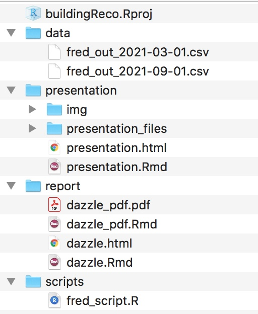

```{r setup, include=FALSE}
options(htmltools.dir.version = FALSE)
knitr::opts_chunk$set(
  fig.width=9, fig.height=3.5, fig.retina=3,
  out.width = "100%",
  cache = FALSE,
  echo = TRUE,
  message = FALSE, 
  warning = FALSE,
  hiline = TRUE
)
```

```{r xaringan-themer, include=FALSE, warning=FALSE}
library(xaringanthemer)
style_mono_accent(
  base_color = "#1c5253",
  header_font_google = google_font("Josefin Sans"),
  text_font_google   = google_font("Montserrat", "300", "300i"),
  code_font_google   = google_font("Fira Mono")
)
```

## Disclaimer

The views expressed in this presentation are strictly my own. They do not necessarily represent the position of the Federal Reserve Bank of Minneapolis or the Federal Reserve System.

---

## Who am I?

```{r echo=FALSE, out.width= "40%", out.extra='style="float:right; padding:10px"'}
knitr::include_graphics("img/LindseyDietz.png")
```

- [Financial Economist/Stress Testing Production Function Lead @ Federal Reserve Bank of Minneapolis ](https://www.minneapolisfed.org/news-releases/2021/dietz-recognized-for-excellence-in-bank-supervision)
    - Lead the team working on implementation, execution, and analysis of models used to conduct stress testing on the nation's largest banks
    
- [Co-creator of the noRth conference](https://rnorthconference.github.io/)
- [Co-organizer of the R Ladies - Twin Cities meetup](https://www.meetup.com/rladies-tc/members/)
- [IF/THEN AAAS STEM Ambassador Alumni](https://www.ifthenshecan.org/ambassadors/)

- [Hall of Fame college athlete at the University of Minnesota-Duluth](https://umdbulldogs.com/honors/umd-athletic-hall-of-fame/lindsey-dietz/130)
- PhD in Statistics from University of Minnesota-Twin Cities
---

## Goal of this discussion

Introduce R tools communicate a data story in a professional, sustainable, and beautiful way. 
.center[]

```{r echo=FALSE, out.width= "75%", out.extra='style="float:center"'}
knitr::include_graphics("img/environmental-data-science-r4ds-general.png")
```

---

## Thank you Iowa State!
Two R visionaries did their doctoral work at Iowa State. 
.pull-left[
[**Hadley Wickham**](https://hadley.nz/), Chief Scientist at RStudio
Creator of the `tidyverse` (`ggplot2`, `dplyr`, ...)

]
.pull-right[
[**Yihui Xie**](https://yihui.org/), Software Engineer at RStudio
Creator of `rmarkdown` + workflow tools

]

---

## In this tutorial

- How to set up your R ecosystem to support report creation in HTML (and PDF)

--

- Examples of table and graphics packages to support analysis

--

- Tips and tricks to make your reports dazzling and reproducible


---

## Not in this tutorial

>- Setting up version control - please use it! Check out Jenny Bryan's [Happy Git and Github with R](https://happygitwithr.com/)
>- Details of the tables or graphics packages - these could easily be their own tutorials
>- Shiny - we are going to focus on HTML (primary) and PDF (secondary) reports

The good news is several speakers tomorrow will cover Shiny and other graphics applications!

---

## Older process of reporting

- Do analysis in one tool (R/SAS/SPSS/etc.)
--

- Make tables and charts in another tool (Excel)
--

- Paste everything into a text editor (Word/LaTeX)
--

- Turn it into a final product (PDF)
--
.center[

]

---

.center[]

---

## What is R Markdown?

R code + Markdown (text-to-HTML conversion tool) = R Markdown

--

R Markdown files are designed to be used in three ways:

--
 - As an environment for you to do data science.
 
--

 - Collaborating with other data scientists with interest in your conclusions and how you reached them (the code).

--
 - **For communicating to decision makers, who want to focus on the conclusions, not the code behind the analysis.**

---

## Let's do it!

 1. Open the 0_dazzle.Rmd file inside the report folder
     - YAML Header
     - Code chunks
     - Markdown/LaTeX
 2. Open the 1_dazzle.Rmd file inside the report folder
     - File organization
 3. Open the 2_dazzle.Rmd file inside the report folder
     - Knitting with parameters
 4. Open the 3_dazzle.Rmd file inside the report folder
     - Adding HTML and tables
---

## Dazzling Elements in R Markdown

 - Using parameters in YAML header
 - Hiding code chunks and including 'Easter eggs' for other analysts
 - Using tabs and drop downs to improve pagination
 - Adding meaningful color to output
 - [Style output using HTML themes](https://www.datadreaming.org/post/r-markdown-theme-gallery/)
   
---

## Folder Infrastructure

.pull-left[ 

- Store long R scripts separate from your R Markdown files
 
- Consider preprocessing and storage of summary data 
 
- Don't try to fit too much into one report; separate reports into their own folder
 ]
 
.pull-right[ 
 
 

]

---

## Why HTML

.pull-left[

]

--

.pull-right[
- HTML is *interactive* without being Shiny
- HTML is *portable* and everyone you know has a web browser
- TeX overhead can be high for creation of pdf and RMD files may fail to knit in different environments 
]

---

## If you must PDF

 - As long as you are not using LaTeX outside of R, you can use a minimal install of TeX via the `tinytex` package
```r 
install.packages('tinytex')
tinytex::install_tinytex()
```
 - [TinyTeX is a custom LaTeX distribution based on TeX Live that is small in size](https://yihui.org/tinytex/)

 - YMMV: errors can accumulate especially if you don't have admin rights on your computer

---

## Step 3. Build your tabular content

There are many table packages. For HTML, `DT` and `reactable` are good starting points. For pdf, `kableExtra` is the gold standard.

.center[]

---

## Step 4. Build your graphical content

`ggplot2` works great as a static graphics package. For interactive graphics, use packages like `plotly` or `highcharter`.

.center[]

---


## Tips for Tables and Graphics

 - Create tables and graphics to support a narrative
     + Storyboard your ideas on paper or a whiteboard before diving in
 - Build the tables and graphics outside of R Markdown first to avoid extra loading overhead
 - Think about your user's needs
     + Do they like to download the data?
     + Are you using color in an intentional way? (1 in 12 men are colorblind)

---

## Additional UX principles for reporting

Your report should:

 - Have a clear hierarchy that makes navigation natural
 - Understand and embrace accessibility
 - Maintain time consistency - transition to or away from ideas slowly
 
---

## Extensions

 - Version control of your reports
 - Deployment on a centralized server such as RStudio Connect opens up options such as scheduled reporting with email blasts
 - HTML reporting could be extended to true Shiny reporting if your users are asking for more interactivity 

---

## References and Credits

 - Artwork by Allison Horst sourced from [**Github**](https://github.com/allisonhorst/stats-illustrations)
 - [**R for Data Science**](https://r4ds.had.co.nz/workflow-projects.html) 
 - [**Advanced R**](https://adv-r.hadley.nz/)
 - [**Happy Git and Github with R**](https://happygitwithr.com/)
 - [**R Markdown Driven Development by Emily Riederer at rstudio::conf 2020**](https://www.rstudio.com/resources/rstudioconf-2020/rmarkdown-driven-development/)

Slides created via the R packages:

 - [**xaringan**](https://github.com/yihui/xaringan)
 - [**xaringanthemer**](https://github.com/gadenbuie/xaringanthemer)

---
class: inverse center middle

# Topic Changing Interstitial

---
